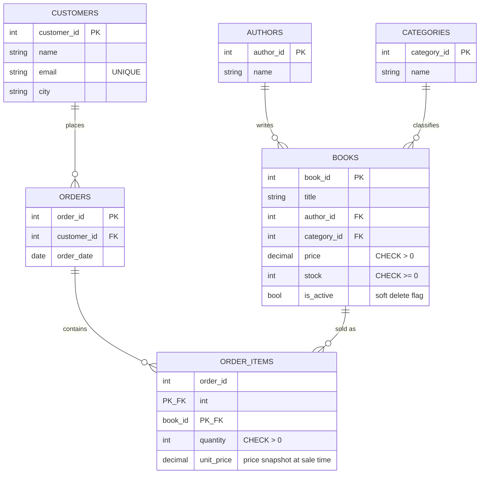

# BookStore SQL Database

A relational database for an online bookstore: catalog (books, authors,
categories), customers, and sales (orders + order items). Built to satisfy
data-integrity rules around pricing, stock, and historical sales accuracy.

## Description

- **Catalog**: `authors`, `categories`, `books`. Each book belongs to exactly
  one author and one category (kept simple on purpose — easy to extend to
  many-to-many later if a book ever needs multiple authors/categories).
- **Customers**: one row per person, unique email enforced at the DB level.
- **Sales**: an `orders` row represents one checkout/purchase event. Each
  order can hold multiple books via `order_items` (the many-to-many link
  between orders and books), so a customer can buy several books in one
  purchase.
- **Soft delete on books** (`is_active` flag): books are never hard-deleted.
  "Removing" a book from sale just flips `is_active = 0`, so it disappears
  from the public catalog (`book_catalog` view) but old `order_items` rows
  still resolve correctly — old sales records are never broken.
- **Price snapshot**: `order_items.unit_price` stores the book's price *at
  the moment of sale*, copied from `books.price`. If the book's price
  changes later, past orders keep showing what the customer actually paid.
- **Data integrity constraints**:
  - `books.price > 0` (CHECK constraint — no zero/negative prices)
  - `books.stock >= 0` (CHECK constraint — no negative stock)
  - `customers.email` is `UNIQUE` (no duplicate registrations)
  - `order_items.book_id` is `ON DELETE RESTRICT` — a book with sales
    history can't be hard-deleted, reinforcing the soft-delete pattern above

## Files

- `bookstore.sql` — full schema, sample data, and answers to tasks 3–14,
  numbered with comments matching the assignment.

## ERD




To call the stored procedure (task 14):

```sql
exec get_customer_purchases @p_customer_id = 1;
```
